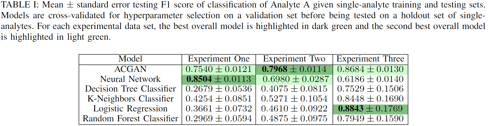

# ACGANs Improve Chemical Sensors for Challenging Distributions
Public repo corresponding to ACGANs Improve Chemical Sensors for Challenging Distributions - ICMLA 2022 Oral Presentation + Paper

Images, tables, abstract, description. Can't provide data due to Defense Threat Reduction Agency project

# Cycles Improve Conditional Generators

Conditional Generative Adversarial Networks (CGANs) are diversely utilized for data synthesis in applied sciences and natural image tasks. Conditional generative models extend upon data generation to account for labelled data by estimating joint distributions of samples and labels. We present a family of modified CGANs which leverage cycles between prior and data spaces to improve upon baselines for natural image synthesis and natural image classification with three primary contributions. 

- An ablation study on synthesis of [CIFAR-10](https://www.cs.toronto.edu/~kriz/cifar.html) proposing three novel architectures for conditional data generation which demonstrate improvement on baseline generation quality for a natural image dataset as well as increasingly small subsets across multiple generative metrics.

- A novel approach to structure latent representations by learning a paired structured condition space and weakly structured variation space with desirable sampling and supervised learning properties. 

- A discussion of conditional image synthesis metrics with a comparison to alternative methods for evaluating the quality of conditionally-generated images. 

The alterations to include cycles in conditional generators demonstrate improvements to comparable baseline CGANs across a variety of established and proposed metrics. Additional experiments demonstrate the successes of inducing cycles in conditional GANs for both image synthesis and image classification over comparable models.

## Novelty
We induce cycles for conditional generators to move samples between labelled latent and data spaces such that the generative quality and supervised learning ability of the resulting model is improved.

Conditional Autoencoder-GAN             |  Cycle Conditional Autoencoder-GAN
:-------------------------:|:-------------------------:
  |  

