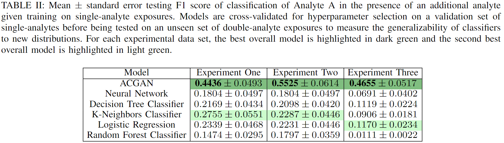
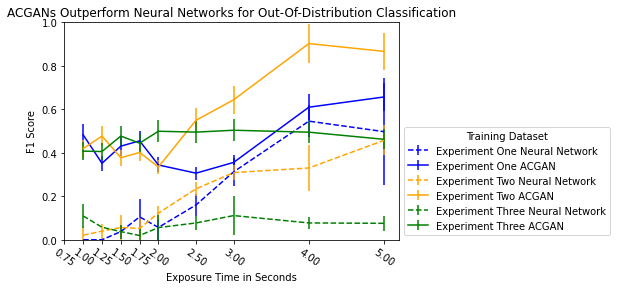

# ACGANs Improve Chemical Sensors for Challenging Distributions
Public repo corresponding to ACGANs Improve Chemical Sensors for Challenging Distributions - ICMLA 2022 Oral Presentation + Paper

Contributions:

- Proposed utilization of ACGANs as generalizable multi-task learners which improve testing classification outcomes on challenging distribution shifts without additionally-annotated data.
- Optimized benchmarks for four baseline machine learning models as well as a comparison between neural networks and ACGANs for obscured analyte detection.
- Scaling behavior of classifiers with respect to combinations of single-analyte and multi-analyte training on multi-analyte trianing outcomes.

Training machine learning models to remain accurate on distribution-shifted testing data requires performing many diverse, costly experiments in controlled laboratory settings to create a well-rounded training data set. In practice even expensive, large data sets may be insufficient for generalization of a trained model to a real-world testing distribution. It is possible but costly to create large, diverse datasets of single-analyte exposures, but experimentation with multi-analyte combinations quickly becomes intractable.

  

With this in mind, we benchmark and propose machine learning and deep learning approaches to the detection of obscured chemical analytes given only single-analyte training. We significantly improve upon baseline classification of a particular chemical analyte borne in vapor mixed with an obscurant chemical agent by inducing multitask learning through adversarial data synthesizing models.

Given chemical analyte exposure times between 0.75 and 5 seconds and across three unique experiment data sets comprised of different sensors and experimental controls, we find approaches utilizing Auxiliary Classifier Generative Adversarial Networks (ACGANs) outperform machine learning and comparable neural network approaches. We corroborate with multitask learning to find that across domains the utilization of generative tasks in supervised learners may increase data efficiency and model robustness to out-of-distribution samples without additional data annotation.

Unobscured Analyte             |  Obscured Analyte Mixture
:-------------------------:|:-------------------------:
  |  

